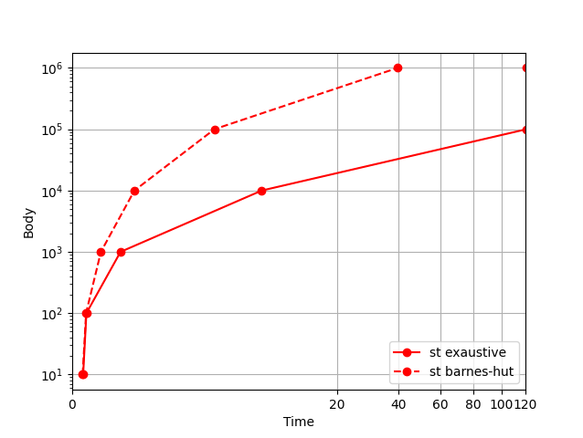
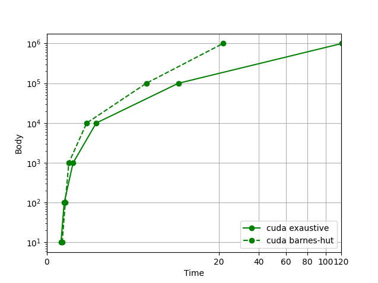
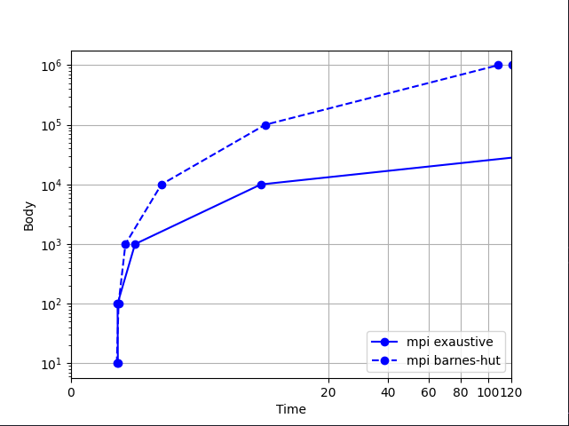
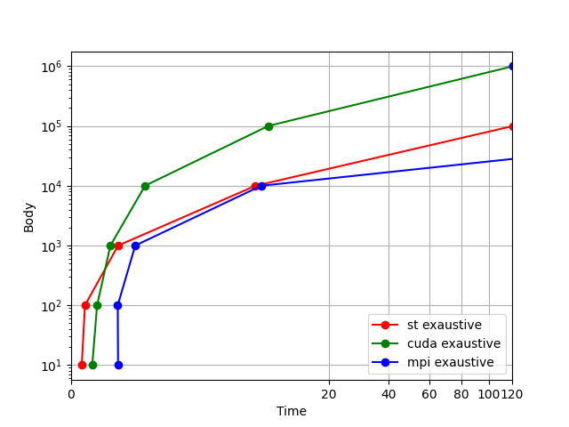
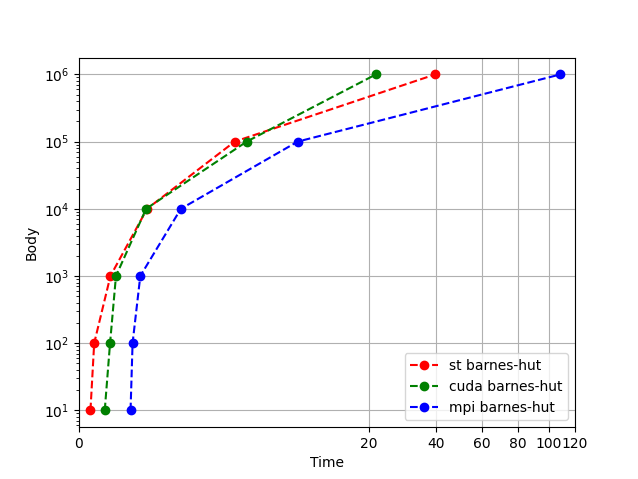

Dmytro Grad

Matteo Bernardo

Silvio Gori

# Problema N-Corpi

Il problema degli N-corpi o "N-body problem" dall' inglese, è uno dei problemi più incisivi della fisica matematica, basato sulla seconda legge del moto e la legge di gravitazione universale stipulate da Newton.

Viene posto il quesito del calcolo del moto di **n** particelle, soggette alla legge di gravitazione universale date: le loro masse, velocità, posizione nello spazio e il loro mutare nel tempo.

## Metodo Naive

Utilizzando la formula di gravitazione universale unita alla seconda legge del moto e definendo 2 particelle **q** e **k** tali che:

- **m<b>q </b>** **m<b>k </b>** siano le loro rispettive masse;
- **s<b>q </b>** **s<b>k </b>** la loro posizione nello spazio;
- **t** un determinato istante di tempo;
- ed essendo **G** la costante di gravitazione universale;

La forza **f<b>qk </b>** che esercita **k** sulla particella **q** è data da:

Per calcolare le forze che tutte le particelle esercitano su **q** , definito come: **F<b>q </b>**, possiamo usare la sommatoria:
$$F_q = \sum^{n-1}_{k=0 \space\land \space k!=q}{f_qk}$$
Applicando tale sommatoria a tutte le particelle si può creare un **algoritmo** che calcola ogni volta le forze relative alle particelle, definito come approccio **naive**, ergo un calcolo bruteforce di tutte le forze delle particelle e successivamente la posizione e velocità relativa. Ciò aumenta notevolmente i tempi di simulazione specialmente per grandi quantità di particelle, avendo un costo computazionale elevato.

## Algoritmo di Barnes-Hut

Un altro approccio per ridurre drasticamente il numero di calcoli che deve svolgere il programma è quello di utilizzare l'**algoritmo di Barnes-Hut**.

In queste simulazioni viene usato un albero a **4 nodi** per radice, detto **quadTree** e le simulazioni sono eseguite su un piano bidimensionale.

L' algoritmo divide, ricorsivamente, la regione dello spazio che contiene le particelle in 4 parti, fino a raggiungere la capacità di una particella per quandrante.

Si procede calcolando il centro di massa di ogni quadrante dell' albero partendo dalle foglie arrivando alla radice, per ogni centro di massa **cm**.
Ogni **cm** è coposto da; un valore che indica la massa e 2 valori che indicano la posizione del suo epicentro (simulazione bidimensionale), per ogni quadrante:

- in caso ci sia una particella sola nel quadrante, ergo trattasi di una foglia : il **cm** prende come parametri la massa e i valori di posizione della particella stessa.
- in caso si stesse esplorando un nodo e quindi ci siano più cm per quandrante:

  - per determinare la massa, si sommano tra loro i **cm** degli **n** figli.

  - per ottenerne la posizione:
    si fa la somma del prodotto tra le masse (**mass<b>f0-(n-1)</b>**) e le posizioni di tutti i figli(**X<b>f0-(n-1) </b>** ) e si divide per la massa totale del **cm** (**mass<b>cm </b>**).
    Ad esempio, in una griglia bidimensionale per trovare la x del epicentro del cm ( **X<b>cm </b>** )si può usare la formula:

$$X_{cm} = ({\sum^{i=0}_{n-1}mass_{fi} * X_{fi}})\space/\space{mass_{cm}}$$

Una volta calcolati i centri di massa si passa al calcolo delle forze che agiscono sulle particelle, si esamina l' albero dalla radice alle foglie, guardando prima i figli ( post-order traversal).
Per ridurre i calcoli si usa un filtro, una costante **θ**, di solito dal valore compreso tra 0 e 1.5, che determina fino a che grado avviene l'approssimazione:

- se **θ** = 0, la velocità dell' algoritmo sarà uguale a quello dell' algoritmo naive (non approssimato).
- Per valori **θ** maggiori di 1 si inizia a notare l' impatto dell' approssimazione sulla velocità di calcolo anche con poche particelle, aumentando naturalmente l'errore d' approssimazione sui vari calcoli.

Il calcolo delle forze delle particelle procede con le stesse formule del metodo naive, ma riducendo i calcoli; usando la massa dei centri di massa invece delle varie masse delle particelle e scegliendo i centri di massa da utilizzare in base al filtro del **θ**, riducendo l' accesso all' albero e quindi la quantità di calcoli per paritcella, per ogni particella.

# Generatore di particelle e testing degli algoritmi

## Funzione generate

Per facilitare l'approccio di testing ed eventuali casi limite viene usata una funzione che stampa su un file di testo delle particelle, permettendo quindi di creare un numero esatto e variabile di particelle, con masse, posizioni e velocità randomiche e replicabili attraverso un seed. Tutti i parametri utili alla funzione (numero di particelle da generare e seed), vengono imposti come argomenti dal main o gestiti internamente nel codice.

## Main

La funzione main esegue i test sugli algoritmi implementati, utilizzando Subprocess per misurare in maniera precisa i tempi di esecuzione.

Ad ogni esecuzione viene generato un set di particelle comune a tutti gli algoritmi, partendo da 10 particelle, che aumentano di 10 a ogni iterazione.

Ogni algoritmo viene eseguito più volte (scelte dall' utente) con seed diverso, calcolando la media delle tempistiche sui diversi input di stesso numero di particelle.

Successivamente l'algoritmo genera un grafico che mostra le prestazioni, mettendo a confronto la media delle tempistiche.

## Compare

Per verificare la coerenza degli algoritmi generati, è stata scritta una funzione di comparazione degli output, utile solo in fase di debug.
Una tra le problematiche riscontrate durante la creazione dell'algoritmo di comparazione è causata da una diversa approssimazione dei calcoli prodotti dagli algoritmi dipendeni dalla gpu (CUDA), per quanto riguarda i calcoli con virgola mobile.

Fonte ufficiale:
https://docs.nvidia.com/cuda/floating-point/index.html

# Implementazione seriale

## Metodo Naive

L' implementazione seriale del **metodo naive** utilizza uno struct di particelle, ogni particella contiene informazioni sulla **massa**, **posizione**, **forza applicata** alla particella e **velocità** della stessa, questi ultimi tre parametri vengono suddivisi tra gli **assi x e y**.
Ogni particella viene inserita in un array di lungezza: numero di particelle.
La forza di ogni particella a inizio simulazione viene inizializzata a 0.

L' algoritmo procede ad **intervalli di tempo**, per ogni intervallo si eseguono 2 funzioni:

- **Calcolo delle forze**
- **Calcolo delle posizioni**

La prima funzione confronta una particella con le altre, ad esclusione di se stessa, per calcolare le forze su asse x e y utilizzando la formula descritta nell' introduzione.
Viene ripetuta per tutte le particelle.

La funzione del **calcolo delle posizioni** calcola la posizione e la velocità di una particella, essendo questi parametri direttamente infuenzati dalle forze, sono calcolati dopo l'esecuzione della funzione precedente, anche questo metodo viene ripetuto per ogni particella.

l'Algoritmo termina stampando su un file di testo:
**posizione, massa, forza** e **velocità** di ogni particella.

## Algoritmo di Barnes-Hut

Anche l'implementazione seriale dell'algoritmo di Barnes-Hut sfrutta lo stesso struct delle particelle, descritto nel metodo Naive, con aggiunta di 2 struct:

- **Centri di massa**:
  contiene; la posizione x,y e la massa del centro di massa.

- **Albero**:
  contiene; i suoi limiti superiore, inferiore, destro e sinistro (up, down, left, right), un puntatore a una particella, un puntatore al centro di massa, un booleano che indica se si tratta di una foglia o meno e i puntatori ai suoi sottonodi.

L'algoritmo come per il seriale procede a intervalli di tempo, ad ogni intervallo:

- Usando la funzione **boundingBox** si calcolano le dimensioni spaziali massime necessarie a contenere tutte le particelle.

- Tali dimensioni sono passate come parametri globali e usati dalla funzione **initialQuad** per inizializzare l'albero creando la radice.

- Le particelle vengono passate alla funzione ricorsiva **insert** che le colloca all'interno dell'albero e divide quest'ultimo in quadranti.
- La funzione **centerMass** calcola i centri di massa per tutti i nodi dell'albero, successivamente **treeForce** approssima le forze applicate alle particelle, infine **calculatePosition** calcola le posizioni delle particelle.

- L'albero viene distrutto e si passa al prossimo intervallo di tempo.

Al termine viene stampato su file il risultato.

# Implementazione CUDA

Le logiche di esecuzione tra l'approccio CUDA e quello seriale sono simili, vengono quindi elencate eventuali differenze di progettazione per il riadattamento al calcolo da GPU.

Entrambi gli algoritmi verificano la presenza di una GPU nvidia nel sistema e calcolano le relative dimensioni dei blocchi di CUDA-Cores a disposizione.

In caso di mancata presenza di una GPU supportata, il programma termina con errore.

## Metodo Naive

A differenza dell'approccio seriale, i dati delle particelle vengono inseriti nei vari **array**, tale struttura risulta semplificare il trasferimento dei dati da memoria di sistema, a memoria globale della GPU, e ottimizza le operazioni di trasferimento dei dati tra quest'ultima e la memoria condivisa dei blocchi.

L' algoritmo funziona come segue:

- Ad ogni particella presa in input, viene assegnato un **id**, da 0 al numero di particelle - 1, questo id determina nei vari array, la posizione per i dati da inserire della particella (**posizione x e y,massa, forza x e y, velocita x e y**)
- Vengono caricati gli array sulla memoria globale della GPU e ad ogni particella viene assegnato un thread.
- Ogni blocco carica nella memoria condivisa una porzione degli array, pari al numero di thread che gli sono stati assegnati, così da renderli condivisibili al suo interno, finiti i calcoli da parte di ogni thread si carica la sezione delle particelle successiva.
- Ogni thread esegue i calcoli tra la particella assegnatagli e tutte quelle presenti nella memoria condivisa.
- Terminati i calcoli delle forze e delle posizioni di ogni particella, i risultati vengono riportati nei rispettivi array in memoria globale e sostituiti con quelli iniziali, per l'esecuzione del prossimo intervallo di tempo.
- Infine i risultati sono trasferiti dalla memoria globale della GPU a quella di sistema, per poter essere stampati su un file di output.

## Algoritmo di Barnes-Hut

Anche in questo caso sono state apportate modifiche per la parallelizzazione, la struttura delle particelle è la stessa ad "array" del metodo naive cuda, con aggiunta di un array (**child**, da codice)che rappresenta i nodi dell'albero.

- Come per la versione seriale, si calcola un' area di esecuzione (**bounding-box**), in questo caso, il calcolo viene parallelizzato in riduzione.

///////////////////////////////////////////////
- Con la seguente formula si ottiene un valore che indica in maniera probabilistica la possibile dimensione massima dell' albero, garantendo un overhead di sicurezza ed evitando l'uso delle liste dinamiche: Dato **N** come numero di particelle:
$$(N * 30 + 12000) * 5$$

Gli array che utilizzano queste dimensioni sono: **child** (array dell'albero), x (posizioni x), y (posizioni y), mass (masse di particelle e centri di massa).
- Questi array sono divisi in 2 aree: 
  - Le posizioni da 0 a N-1 sono riservate alle particelle.
  - Le posizioni da N fino al valore designato, invece, rappresentano i dati dell' albero e i relativi centri di massa.
- Nelle posizioni da N in poi, ogni nodo del quad-tree è rappresentato dalle seguenti 5 variabili, posizionalmente contigue:
  - Id del padre.
  - Figlio del quadrante **nord-ovest**.
  - Figlio del quadrante **sud-ovest**.
  - Figlio del quadrante **nord-est**.
  - Figlio del quadrante **sud-est**. Il numero di questa cella rappresenta anche l'Id del nodo corrente.
- Si prosegue con la creazione dell'albero in maniera parallela, utilizzando un'operazione di compare and swap per prevenire la concorrenza, inoltre, per aumentarne l'efficenza, una volta genearato un figlio del nodo corrente, se non più utile al thread che lo sta gestendo, viene liberato per poter essere utilizzato da un altro thread.

- L'algoritmo snocciola l'albero a partire dalle particelle (child da 0 a N), che a differenza del seriale, poichè tengono conto del quadrante assegnatogli, rappresentano le foglie dell' albero e per evitare rallentamenti nel codice:
  - Un thread a parire dalla foglia calcola il centro di massa di ogni nodo padre, risalendo l'albero.
  - In caso non gli fosse possibile calcolare il centro di massa per mancanza di dati (che aspetta di ricevere da un altro thread), terminerà lasciando il lavoro al prossimo thread che sicuramente visiterà il nodo.

- Calcolati i centri massa, si passa a calcolare le forze, ogni thread calcola le forze su una sola particella, scendendo e risalendo l'albero con l'ausilio del puntatore al padre e calcolando le rispettive forze usando il valore theta designato.
- Il calcolo della posizione e delle velocità sono eseguiti nello stesso modo del calcolo delle forze.
- Alla fine vengono riportati i risultati e resettati gli array (il processo di reset degli array nel codice, per convenienza, viene inserita come prima operazione).
//////////////////////////////////////////////////

- Viene creato un array (**child**, da codice), che come anche gli altri ha dimensione, dato **N** come numero di particelle:
  $$(N * 30 + 12000) * 5$$
- I valori riportati dalla funzione indicano in maniera probabilistica la possibile dimensione massima dell' albero, garantendo un overhead di sicurezza e evitando l'uso di liste dinamiche gli array che utilizzano queste dimensioni sono: child (array dell'albero), x (posizioni x), y (posizioni y), mass (masse di particelle e centri di massa)
- gli array di queste dimensioni si dividono in 2 aree, da posizione 0 a N-1 rappresentano le particelle, da N fino al valore designato, rappresentano i dati dell' albero e relativi centri di massa
- il modo in cui vengo rappresentati i nodi e relativi dati negli array tra le posizioni maggiori di N, si basa sulle 5 variabili che necissità ogni nodo, occupanmdo così 5 caselle nell'array che contengono:
  - Id del padre.
  - Figlio del quadrante **nord-ovest**.
  - Figlio del quadrante **sud-ovest**.
  - Figlio del quadrante **nord-est**.
  - Figlio del quadrante **sud-est**. Il numero di questa cella rappresenta anche l'Id del nodo corrente.
- Si prosegue creando l'albero in maniera parallela, utilizzando un'operazione di compare and swap per prevenire la concorrenza, inoltre, per aumentarne l'efficenza il una volta genearato un figlio del nodo corrente, se non più utile al thread che lo sta gestendo, viene liberato per poter essere utilizzato da un altro thread.
- L'algoritmo snocciola l'albero a partire dalle particelle (child da 0 a N), che a differenza del seriale, poichè tengono conto del quadrante assegnatogli, rappresentano le foglie dell' albero e per evitare rallentamenti nel codice:
  - Un thread a parire dalla foglia calcola il centro di massa di ogni nodo padre, risalendo l'albero.
  - In caso non gli fosse possibile calcolare il centro di massa per mancanza di dati (che aspetta di ricevere da un altro thread), terminerà lasciando il lavoro di calcolo al prossimo thread che sicuramente visita il nodo.
- Calcolati i centri massa, si passa a calcolare le forze, ogni thread calcola le forze su una sola particella, scendendo e risalendo l'albero usando il puntatore al padre e calcolando le rispettive forze usando il valore theta designato.
- Il calcolo della posizione e delle velocità prosegue come il calcolo delle forze.
- Al fine di tutto vengono riportati i risultati e resettati gli array (il processo di reset degli array nel codice, per convenienza, viene inserita come prima operazione, non cambia la logica di funzionamento) .
////////////////////////////////////////////////////

Finiti i timestep viene liberata la memoria e vengono riportati i risultati in memoria principale per poi essere stampati in output.

# Implementazione MPI

Per quanto riguarda l'implementaione con MPI, si ritorna all'utilizzo degli struct, poiche MPI fornisce la possibilità di creare tipi di dato personalizzati per la libreria e il successivo parsing di essi.

## Metodo Naive

Il metodo naive in questo caso, è simile nel ragionamento all'implementazione seriale, utilizza un solo core (0) per leggere il file di input e comunicare i dati tra i vari core in **broadcast** (MPI_Broadcast). 
Per ogni unità di tempo:

- Ogni core, tramite un calcolo, sà quante e quali particelle dovrà elaborare.
- Vengono eseguiti i calcoli di forza e spostamento, con funzioni analoghe all'implementazione seriale. Una volta che tutti i core hanno finito i propri calcoli e si siano sincronizzati, i risultati  sono comunicati via broadcast.

Alla fine il core master (0) stampa in output i risultati della simulazione.

## Algoritmo di Barnes-Hut

Come per il metodo Naive MPI, anche in questo caso l'implementazione segue un ragionamento simile a quello seriale, i dati sono passati allo stesso modo come spiegato in precedenza, l'algoritmo, sempre ad intervalli di tempo prosegue:

- Calcolando le dimensioni di lavoro (**bounding-box**) utilizzando una riduzione (MPI_Allreduce).
- Ogni core costruisce un albero delle profondità assegnando tutte le particelle e i rispettivi centri di massa.
- Come nel metodo naive MPI, vengono assegnate e calcolate le forze e lo spostamento, approssimandole con il tetha, solo di determinate particelle.
- Viene comunicato il risultato in broadcast e distrutto l'albero.

Alla fine delle unità di tempo il core master (0) stampa i risultati in output.

# Valutazione algoritmi e scelte progettuali

La parte di lettura degli input, per convenienza di elaborazione, viene tenuta seriale, per tutte le implementazioni, data l'incapacità di CUDA di poter leggere un file di input in parallelo.

## Implementazione CUDA Naive

In questo caso la parallelizzazione avviene per tutte le fasi di calcolo dell'algoritmo.

## Implementazione CUDA di Barnes-Hut

L'algoritmo viene parallelizzato completamente in tutte le sue fasi di calcolo e creazione dell'albero.

## Implementazione MPI Naive

L' algoritmo viene completamente parallelizzato, come anche l'implementazione di barnes hut, una causa di problemi prestazionali è quella dell overhead di comunicazioni che vengono effettuate.

## Implementazione MPI di Barnes-Hut

L'alrgotmo parallelizza la costruzione della bounding box, ma non quella dell'albero, teorizzando che richiederebbe un overhead di comunicazione molto elevato, rendendo ancor meno efficente l'algoritmo.
le restanti funzioni vengono parallelizzate come col metodo naive, ma mantendo l'approssimazione con la distanza tramite theta.

# Tempistiche

  | N bodies 	|    St Naive   	|     St B-H    	|   CUDA Naive  	|    CUDA B-H   	|   MPI Naive   	|    MPI B-H    	|
  |:--------:	|:-------------:	|:-------------:	|:-------------:	|:-------------:	|:-------------:	|:-------------:	|
  |    10    	|  4,9 x 10^-4  	| 4,196 x 10^-4 	| 4,786 x 10^-3 	| 6,256 x 10^-3 	| 6,855 x 10^-2 	| 6,332 x 10^-2 	|
  |    100   	| 1,168 x 10^-3 	| 1,079 x 10^-3 	| 9,541 x 10^-3 	| 1,169 x 10^-3 	| 6,707 x 10^-2 	| 7,199 x 10^-2 	|
  |   1000   	| 6,906 x 10^-2 	| 1,217 x 10^-2 	| 3,791 x 10^-2 	| 2,091 x 10^-2 	| 1,941 x 10^-1 	| 1,129 x 10^-1 	|
  |   10000  	|     6,568     	| 1,602 x 10^-1 	| 3,118 x 10^-1 	| 1,525 x 10^-1 	|     7,269     	| 6,133 x 10^-1 	|
  |  100000  	|    > 2 min    	|     2,522     	|     8,194     	|     3,231     	|     70,567    	|     7,830     	|
  |  1000000 	|    > 2 min    	|     39,821    	|    > 2 min    	|     21,705    	|    > 2 min    	|    108,647    	|

  ## Signle thread
  
  
  Come previsto barnes-hut riesce a sopravvalere sull'implementazione naive a partire già da 10^2, verrà usato come grafico di confronto per le altre implementazioni.
  ## CUDA
  
  
  L'implementazione di Barnes-Hut è ovviamente la più performante.
  L'Implementazione barnes-hut diventa piu efficiente rispetto al metodo Naive superando i 10^2 corpi, come per il single thread.

  ## MPI
  
  
   Anche qui l'implementazione Barnes-Hut comincia a prevalere sul metodo Naive una volta superati i 10^2 corpi.

  ## Naive
  
  
  L'implementazione CUDA e MPI del metodo Naive sono piu lente inizialmente a causa delle chiamate alle rispettive librerie, con Cuda che prevale su MPI a prescindere dal numero di corpi.
  A partire da 10^3 corpi, l'implementazione CUDA è più efficente del implementa Naive.
  MPI d'altro canto per quanto migliori in tempistiche per 10^4 corpi, con probabile ulteriore miglioramento successivo, risulta essere poco efficace allo svolgimento del problema, per via delle eccessive comunicazioni.

  ## Barnes-Hut
  
  
  Per quanto riguarda Barnes-Hut i test dimostrano che i risultati sono simili a quanto espresso prima.
  Anche se molto efficente l'implementazione effettuata con CUDA, in casi particolari potrebbe risultare in alberi di profondità elevata, che vanno a peggiorare notevolmente le performance. 
  Di fatto l'algoritmo che dovrebbe superare in efficenza l'implementazione Single-Thread da 10^4 corpi in poi, invece rallenta nell'esecuzione successiva e torna alle performance osservate con 10^6 corpi.
  MPI, causa i problemi sopra riportati risulta il meno performante.
## Considerazioni
  
  MPI data la mole di dati da comunicare tra tutti i processori, dimostra di essere estremamente inefficente per l'applicazione di questo problema, in particolare, con Barnes-Hut è stato impossibile rendere parallela ed efficente la creazione dell'albero.
# Fonti:

Problema di approssimazione in CUDA: https://docs.nvidia.com/cuda/floating-point/index.html

An efficient CUDA implementation of N-Body problem: https://iss.oden.utexas.edu/Publications/Papers/burtscher11.pdf

Parallel-Programming book by Peter Pacheco: ISBN-10:0123742609

N-Body problem explanation: https://patterns.eecs.berkeley.edu/?page_id=193#Barnes_Hut